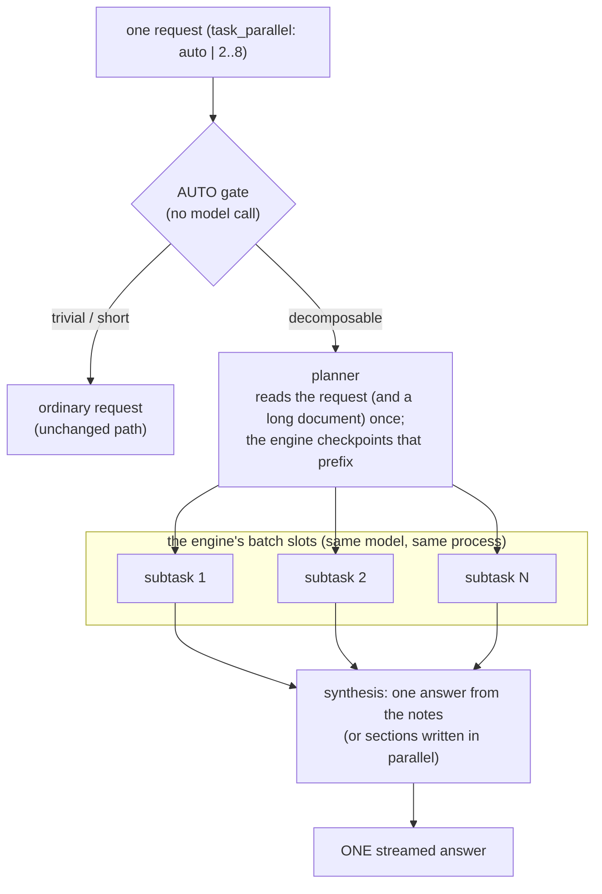

<h1 align="center">Strata Void</h1>

<p align="center"><b>An experimental fork of <a href="https://github.com/Niko1221/Strata">Strata</a> for Intel Arc (SYCL):
one request's work spread over the engine's concurrent batch slots, long-context serving up to 128K, a long
document read once and shared by every step, and an optional retrieval hook.</b></p>

<p align="center">Upstream engine: <a href="https://github.com/Niko1221/Strata">Niko1221/Strata</a> (MIT) ·
this fork: Task-Parallel Requests, <code>--slot-context</code>, faster prompt reading on Arc ·
measured on 3 Intel Arc Pro GPUs (88 GB)</p>

---

> **What this is not.** Task-Parallel Requests do **not** make a single token stream faster. The answer you watch
> being written still streams at the normal rate of one request (~40-45 tok/s on the hardware below). What gets
> shorter is the **end-to-end time until one complex answer is complete**: the engine's otherwise idle concurrent
> slots work on different parts of the same request at the same time.

## What is in this fork

| | What it does | Measured (details: [docs/BENCHMARKS.md](docs/BENCHMARKS.md)) |
|---|---|---|
| **Task-Parallel Requests** | One request → a planner → 2-6 internal requests in the engine's batch slots at once → one answer | complex requests answered **2-3× sooner** (median 181 s → 68 s), blind-graded at least as good |
| **Fast prompt-path dequant** (SYCL) | New IQ4_XS / IQ4_NL → FP16 kernels for the prompt path; bit-identical output | prompt reading **~2×**: 334 → 659 tok/s at 16K; 600-630 tok/s out to 122K tokens |
| **`--slot-context N`** | Batch slots can be smaller than the main context | contexts up to **128K** with batch slots (6 full-size slots stopped at 16K here) |
| **Shared-context reuse** | A long document is read once (by the planner); every later step restores that state instead of re-reading it | 120K-token document: each step admitted in ~1.5-2 s instead of ~200 s |
| **Retrieval hook** (optional) | A generic `ContextProvider`: one retrieval per request, provenance kept, fails open | 0-4 ms per request in the test; requests still answer if the provider is down |

Everything else is upstream Strata: the engine, the OpenAI/Anthropic-compatible server, the CUDA/HIP builds, setup.
The upstream README (with translations) is kept as [README.strata.md](README.strata.md).

## Task-Parallel Requests in one picture



- The subtasks are ordinary internal requests running **concurrently in the engine's batch slots** (`--batch N`):
  no extra model instance, no extra VRAM per request. Each one restores the shared prefix (the request, and a long
  document if there is one) from the engine's checkpoint instead of reading it again.
- Workers hand over **work products** (findings, figures, code), never their reasoning. Only the final answer
  reaches the client.
- It always costs **more compute** than one request (plan + subtasks + synthesis). Every response says how much.

Full design, API and every setting: [docs/TASK_PARALLEL.md](docs/TASK_PARALLEL.md) ·
architecture: [docs/ARCHITECTURE.md](docs/ARCHITECTURE.md).

## Why you might want it

You have a server that can decode several requests at once (here: six slots reach ~113 tok/s together while one
request alone gets ~40), and one user asking for something that takes a long time: a design review, a comparison
across several dimensions, a migration plan, a question over a long document. Instead of one stream thinking
for minutes, the parts run side by side and one synthesis writes the answer.

It does not help for: short questions, chat, a single chain of dependent reasoning, or tasks that need one
careful pass over a very long document (AUTO answers those normally; see [Limitations](#limitations)).

## Benchmark highlights

Hardware for every number on this page (one machine, Intel GPUs only):

| | |
|---|---|
| CPU | AMD Ryzen 9 9950X (16C/32T) |
| Board / RAM | ASUS ProArt B850-CREATOR WIFI NEO · 64 GB DDR5 (4×16 GB, 4800 MT/s) |
| OS | Ubuntu Server 26.04 LTS (26.04.1, kernel 7.0), oneAPI DPC++ 2026.1, Intel compute runtime 26.31 |
| GPUs | Intel Arc Pro **B70** 32 GB + Arc Pro **B65** 32 GB (Battlemage G31) + Arc Pro **B60** 24 GB (G21) = **88 GB** |
| Model | [Swift 1.5 Qwen3.8 Flash-Next](https://huggingface.co/ukisai/Swift-1.5-Qwen3.8-Flash-Next-GGUF) (MoE), **IQ4_XS** (~4-bit, 3 GGUF shards), MTP draft head, `--spec 4` |
| Placement | layer split across the three cards, **every expert in VRAM** (60.93 GiB of expert weights; no RAM spill) |

No NVIDIA GPU was involved in any result here.

**Complex requests** (10 tasks: code review, system design, finance, research, contract review, migration plan;
32K context so the ordinary request has room to finish; every run cold; wall-clock to the end of the answer):

| | ordinary request | notes + synthesis (4 subtasks) | sections only (4) | **AUTO** (final) |
|---|---:|---:|---:|---:|
| median wall-clock | 181 s | **68 s** | 41 s | 78 s |
| geometric mean vs ordinary | 1.00 | **0.37** | 0.23 | **0.50** (0.29 on the 7 it split) |
| blind quality, overall /10 | 7.1 (6.4 with a second grader) | **8.0** | 6.7 | **8.1** |
| answers cut off / empty / looping | 2-3 of 7 | 0 of 7 | 1 of 7 | 0 of 7 |

- "Sections only" was the fastest form but its independently written sections contradicted each other: it is
  **not** what AUTO uses for such requests.
- AUTO answered 3 of the 10 normally (the planner rated them "low" effort or found no independent parts) and sent
  **12 of 12 trivial requests** straight to the ordinary path without calling the planner.
- The answer's own visible decode rate stayed ~40-45 tok/s in every mode.

**Long documents** (8K-120K tokens, seeded tasks with known answers): reading dominates (~200 s at 120K, the
same in every mode). After the read, task-parallel steps pay when one request would think at length
(contracts-120k: 244-262 s vs 439 s, or no answer at all in 2 of 3 runs, for the ordinary request) and do not pay
for quick lookups. Sections written without thinking lose figures on long aggregations at 64K+, so AUTO answers
hard long-document questions in one stream. Tables: [docs/BENCHMARKS.md](docs/BENCHMARKS.md).

## Hardware and software

- **Tested:** the three-card Intel Arc Pro system above, Linux, the SYCL engine (`sycl/`), Swift 1.5 Flash-Next
  IQ4_XS with every expert in VRAM.
- **Should work, not measured here:** other Arc cards supported by upstream's SYCL port (B580/B570, B50, A-series
  are listed in [docs/INTEL_ARC.md](docs/INTEL_ARC.md)); fewer cards with a smaller model or quant.
- **Task-Parallel Requests themselves are engine-agnostic** (`serve/task_parallel.py` only issues ordinary
  requests): they work with upstream Strata's CUDA/HIP engines and their batch slots too, but every number in this
  repository was measured on Intel Arc. The `ckpt=` shared-prefix hint and `--slot-context` are implemented in the
  SYCL engine in this fork.
- No model weights are in this repository. You download the model yourself from its Hugging Face page and accept
  its license there (the Swift Open License 1.0 for Swift 1.5; read it, and the base model's terms, before use).

## Build (Linux, Intel Arc)

Prerequisites (details in [docs/INTEL_ARC.md](docs/INTEL_ARC.md)): Intel's GPU driver and Level Zero runtime,
Intel oneAPI DPC++ 2025.3+ with oneMKL, `cmake` 3.24+, `ninja`, `git`, Python 3.10+, and `intel-ocloc` for an
ahead-of-time build.

```sh
git clone https://github.com/Jumbomuffin777/Strata-Void.git && cd Strata-Void
source /opt/intel/oneapi/setvars.sh
# AOT for both Battlemage classes in one binary (B70/B65 = bmg-g31, B60/B580 = bmg-g21); omit for a JIT build
cmake -S sycl -B build-sycl -G Ninja -DCMAKE_C_COMPILER=icx -DCMAKE_CXX_COMPILER=icpx \
      -DSTRATA_SYCL_AOT="bmg-g21,bmg-g31"
cmake --build build-sycl --target strata
python3 -m venv .venv && .venv/bin/pip install -r requirements.txt
```

### Model files

Upstream's `setup.sh` downloads the models it knows (it offers Swift 1.5 as IQ2_XS); the IQ4_XS build measured here is
prepared with upstream's own tools. About 100 GB of disk for the shards, ~5 GB for the draft head:

```sh
# 0. llama.cpp's gguf-py at the commit upstream's setup pins (iq_pack.py and mtp_pack.py read GGUFs with it)
curl -L -o llama.cpp.zip https://github.com/ggml-org/llama.cpp/archive/3cf03257f219afbe7334045ff7c6a06ac68c627d.zip
python3 -m zipfile -e llama.cpp.zip third_party/ && rm llama.cpp.zip
mv third_party/llama.cpp-3cf03257f219afbe7334045ff7c6a06ac68c627d third_party/llama.cpp
# 1. the three IQ4_XS shards (accept the model's license on its page first)
.venv/bin/pip install huggingface_hub
.venv/bin/hf download ukisai/Swift-1.5-Qwen3.8-Flash-Next-GGUF --include "IQ4_XS/*" --local-dir models/swift15
# 2. a Strata pack: the dense/shared tensors in the engine's form (the experts stay in the GGUF)
.venv/bin/python tools/iq_pack.py --gguf models/swift15/IQ4_XS/Swift-1.5-Qwen3.8-Flash-Next-IQ4_XS-00001-of-00003.gguf \
    --out models/swift15-iq4xs-pack --compat-bf16
# 3. the MTP draft head (fetched from the base Qwen3.8-Flash-Next checkpoint by HTTP range requests, then packed)
.venv/bin/python tools/mtp_fetch.py fetch --out models/mtp
.venv/bin/python tools/mtp_pack.py --src models/mtp --experts q2_0 --out models/mtp/mtp-q2_0.gguf
.venv/bin/python tools/mtp_rt.py --gguf models/mtp/mtp-q2_0.gguf --out models/mtp-rt
cp data/draft_vocab_en.bin models/mtp-rt/draft_vocab.bin   # the English draft vocabulary every measurement used
```

`STRATA_GGUF_PY=<path to gguf-py>` works instead of step 0. The expert profile is in the repository
(`data/expert-profile.bin`). Engine flags and the SYCL environment variables are explained in upstream's
[docs/INTEL.md](docs/INTEL.md).

## Run

The server takes a run config (JSON). [examples/](examples/) has the three configurations used for the
benchmarks (32K / 64K / 128K); replace the `/path/to/...` placeholders with your files:

```sh
source /opt/intel/oneapi/setvars.sh   # the engine needs oneAPI's runtime libraries (SYCL, oneMKL)
.venv/bin/python -m serve.server --engine strata --config examples/strata-void-32k.json --port 8095
```

Check it: `curl -s http://127.0.0.1:8095/health` answers `"loaded": true` once the experts are in VRAM.

## Use Task-Parallel Requests

It is **off unless asked for**: per request with `"task_parallel"`, or as a server default in the run config.

```sh
curl -s http://127.0.0.1:8095/v1/chat/completions -H 'Content-Type: application/json' -d '{
  "model": "strata",
  "messages": [{"role": "user", "content": "Design the backend of a ride-hailing dispatch system for a city with up to 100,000 concurrent drivers and 20,000 ride requests per minute at peak. Cover: (1) the data model, (2) real-time driver location ingestion, (3) the rider-driver matching algorithm, (4) how it scales and where the bottlenecks are, (5) failure handling and consistency (no double-assigned drivers), and (6) the main trade-offs you made."}],
  "task_parallel": "auto",
  "stream": true
}'
```

(This is the `arch-dispatch` task of the benchmark: AUTO split it into 4 subtasks there. A one-line version of the same
question is below AUTO's gate - under 160 characters counts as short - and is answered as an ordinary request.)

| `"task_parallel"` | behavior |
|---|---|
| absent, `null`, `false`, `"off"`, `0`, `1` | the ordinary request, unchanged |
| `"auto"` (or `true`) | a model-free gate first; if it passes, the planner chooses 1 (answer normally) or 2..`max_workers` |
| `2` … `8` (e.g. `2`, `4`, `6`) | the planner is asked for exactly that many subtasks (capped by the engine's slots) |

Optional request fields: `"task_parallel_compose"`: `"synthesis"` | `"sections"` | `"direct"` | `"auto"` (how the
answer is written), `"context_items"`: `[{"text": "...", "title": "...", "source": "...", "kind": "document"}]`
(material sent with the request), `"task_parallel_diagnostics": true` (adds the subtasks' objectives to the response
metadata). Server default in the run config:

```json
"task_parallel": {"default": "auto", "max_workers": 4}
```

Every task-parallel response carries a `task_parallel` object: the decision and why, planning/subtask/synthesis
times, tokens generated by every step, the subtasks' aggregate rate, coverage of a long document. Streamed
responses send progress as SSE comments (`: task_parallel planning`), which standard clients ignore.

### How AUTO decides

1. **Gate** (no model call): short/simple/chat requests go straight to the ordinary path (12/12 in the test).
2. **Load**: only slots other requests are not using count; fewer than two free → ordinary request.
3. **Planner** (greedy, no thinking) returns strict JSON: an effort rating and 1..N subtasks. Unusable JSON gets one
   retry with the error; a "low" effort or no independent parts → ordinary request.
4. **Without a long document:** subtasks write notes, one synthesis writes the answer.
5. **With a long document kept in the shared prefix:** a lookup ("low") gets its sections written in parallel; a
   "medium"/"high" request is answered by **one stream that restores what the planner already read** (the quality
   of an ordinary request, without reading the document twice).
6. **A document larger than a batch slot** is cut into chunks at its own structure and the subtasks read slices.

## Limitations

Read these before quoting any number from this repository.

- **Visible generation is unchanged** (~40-45 tok/s here). This is lower end-to-end latency for decomposable work,
  not faster tokens. It is not "120 tok/s single-stream".
- **It helps decomposable work, not every prompt.** Short answers, chat and one chain of dependent reasoning are
  faster without it; AUTO tries to send those down the ordinary path and does not always get it right.
- **Reading a long document is not parallelized.** The engine reads one prompt at a time; at 120K every mode pays
  the same ~200 s before any answer.
- **Parallel slots decode without MTP drafts** (~20-30 tok/s per slot vs ~45 alone), so splitting long careful
  *reasoning* across slots is not faster. Sections written without thinking can disagree with each other and miss
  figures in long aggregations (totals over dozens of items).
- **Single-stream speculative settings** other than the one used (`--spec 4 --spec-min-p 0.5`) did not help:
  `--spec-min-p` 0.3 / 0.7 gave the same text at the same speed; `--spec 5` / `6` were slower and changed the
  output (on some prompts the model answered as if the prompt were garbled); `--spec 3` did not start with this
  configuration. Treat values above 4 as unsupported on this build.
- **Statistics:** the long-document headline cells were repeated 3 times (cold); the 10-task short-request table and
  most other cells ran once per task and mode. One machine, one model, one LLM grader per grading pass (blind,
  answers shuffled). No claim of a universal 2-3× speedup.
- **VRAM:** full-size slots for a shared document fit 4 × 32K (fp16 KV), 3 × 64K (fp16) or 4 × 128K (8-bit KV) on
  this 88 GB system beside every expert; `--slot-context` trades slot size for slot count.
- **Feature off = upstream behavior:** with `task_parallel` absent the server's output matched the previous build
  byte-for-byte on the regression set (6 solo + 6 concurrent requests, a cancelled stream, a follow-up), and the
  new dequant kernels produced identical engine tokens.
- Chat completions only (no tools, structured output or images on the task-parallel path); Linux only for the SYCL
  engine; experimental software.

## Reproduce the benchmarks

[docs/BENCHMARKS.md](docs/BENCHMARKS.md) lists every configuration (context, KV format, slots, `--slot-context`,
layer split) per table, the task sets ([bench/](bench/), [tools/longctx_tasks.py](tools/longctx_tasks.py)), the
runner ([tools/task_parallel_bench.py](tools/task_parallel_bench.py)) and the scorer
([tools/task_parallel_score.py](tools/task_parallel_score.py)). The raw results (every answer with its metadata,
the blind-grading sheets and keys) are attached to the [v0.1.0 release](https://github.com/Jumbomuffin777/Strata-Void/releases/tag/void-v0.1.0).

## Credits

- **Strata** (engine, server, setup, the SYCL port) is the work of **Niko1221 and the Strata contributors**
  ([upstream](https://github.com/Niko1221/Strata)); the SYCL port was started by maxfridbe (#423).
- **Task-Parallel Requests**, the Strata Void direction and the Zability test system: **Jumbomuffin777**.
  Implementation, debugging and benchmarking were AI-assisted (Claude) under his direction.
- Running several sub-requests for one task is a known idea (parallel decoding, map-reduce over documents, agent
  orchestration); this repository is an independently designed serving extension for Strata, not a claim to have
  invented parallel LLM reasoning.

See [ACKNOWLEDGEMENTS.md](ACKNOWLEDGEMENTS.md). License: MIT ([LICENSE](LICENSE)), as upstream.
