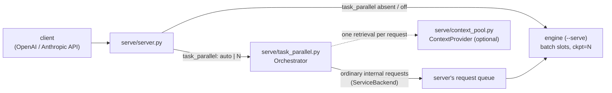

# Architecture

Strata Void is upstream [Strata](https://github.com/Niko1221/Strata) plus three things: an orchestration layer in
the Python server (Task-Parallel Requests), a generic context-provider interface, and SYCL engine changes for long
contexts and faster prompt reading on Intel Arc. Upstream's own architecture (engine, expert cache, MTP drafts,
server, setup) is described in [HOW_IT_WORKS.md](HOW_IT_WORKS.md) and [DETAILS.md](DETAILS.md).



## Layers

| layer | files | what is new here |
|---|---|---|
| Server | `serve/server.py` | parses `task_parallel`, `task_parallel_compose`, `context_items`, `task_parallel_diagnostics`; a `ServiceBackend` through which the orchestrator issues internal requests on the same queue and slots as any client; streams the one answer and the `task_parallel` metadata |
| Orchestration | `serve/task_parallel.py` | the gate, the planner and its strict plan parser, subtasks, the follow-up round, the three ways to write the answer (`synthesis`, `sections`/`direct` through `Composer`), AUTO's load and cost model, timeouts, cancellation |
| Context | `serve/context_pool.py` | `Item` (text, title, source, kind, authority, as_of, pinned), segmentation at a document's own structure, an index for the planner, BM25 assignment, `ContextProvider` / `HttpContextProvider` |
| Engine (SYCL) | `sycl/src/program/generate.cpp`, `sycl/src/core/verify.cpp` | `ckpt=N` (checkpoint a shared prefix, restore it into another slot), `--slot-context N`, batch slots in pipelined groups across a layer split (port of upstream #465), per-stage expert residency |
| Kernels (SYCL) | `sycl/src/kernels/cuda/iq_kernels.dp.cpp` | IQ4_XS / IQ4_NL → FP16 dequant for the prompt path (`STRATA_DQ_FAST`, on by default, bit-identical) |
| Tools | `tools/task_parallel_bench.py`, `task_parallel_score.py`, `task_parallel_report.py`, `longctx_tasks.py`, `sycl/src/kernels/moe_prefill_bench.cpp` | the benchmark runner, scorer, report, seeded long-document tasks, a prompt-path microbenchmark |
| Tests | `serve/test_task_parallel.py`, `serve/test_task_parallel_v2.py`, `serve/test_parallel.py`, `sycl/tests/*` | the orchestration against a fake backend (no GPU), the server's slot handling, engine helpers |

## The orchestrator is engine-agnostic

`Orchestrator` sees the engine only through a four-method `Backend` protocol:

```python
class Backend(Protocol):
    def concurrency(self) -> int: ...                       # internal requests the engine runs at once
    def context(self) -> int: ...                           # the engine's context (tokens)
    def count_tokens(self, call: Call) -> int: ...          # the prompt length of a call
    def generate(self, call: Call, cancel: threading.Event) -> Result: ...
```

plus two optional ones (`slot_context()`, `busy()`). It never touches GPUs, KV caches or engine builds: a subtask is
an ordinary request with its own messages, budget and thinking setting. Any engine behind `serve/server.py` that
runs requests concurrently (upstream's CUDA/HIP `--batch N` as well as this fork's SYCL engine) can serve it. The
tests run it against a scripted fake backend.

## One request, step by step

1. **Parse.** `parse_mode()` maps the request's `task_parallel` to off / auto / an exact count. Requests with tools,
   a structured `response_format` or images are left on the ordinary path.
2. **Material.** `build_material()` gathers long content (the conversation, `context_items`, one provider
   retrieval) and decides the regime: shared (fits one slot less 4,096 tokens: kept whole in the shared prefix) or
   partitioned (cut into chunks at its own structure, an index for the planner).
3. **Gate** (AUTO only). `gate_score()` scores the text without a model call; below the threshold → ordinary path.
   `busy()` counts slots other requests hold; fewer than two free → ordinary path.
4. **Plan.** One internal request (no thinking, greedy) returns strict JSON (`effort`, `parallelism`, `strategy`,
   `subtasks`); `parse_plan()` validates it, one retry with the error if it is unusable. Its prompt starts with the
   shared prefix, sent with `ckpt=<prefix length>`: the engine checkpoints there.
5. **Subtasks** run concurrently, never more than the free slots. Each restores the checkpoint (a device-side copy,
   not a re-read) and reads only its own instruction. A subtask may ask one bounded `NEED:` follow-up; never a
   recursion, never a second plan.
6. **Answer.** `synthesis`: one request writes the answer from the notes. `direct`/`sections`: section writers in
   parallel, assembled in order by `Composer` (deterministic, de-duplicated, no extra model call). AUTO with a large
   shared document and a medium/high effort: one stream that restores the planner's read.
7. **Return.** The client receives one answer stream; progress as SSE comments; a final `task_parallel` object with
   the decision, timings and token counts. Subtask texts and any reasoning stay inside the request.

## Engine changes (SYCL)

- **`ckpt=N`** on a request: after reading N prompt tokens the engine saves the slot's state; a later request whose
  first N tokens match restores it into its own slot (a copy: each slot keeps its own KV state) and reads only the
  rest. The engine announces support with `INFO prefix_ckpt=1`; without it the orchestrator works unchanged and
  every step reads the shared prefix again.
- **`--slot-context N`**: batch-slot sessions sized for N cells instead of the full `--max-context`, so one long
  request and several shorter slots fit together. The engine reports `INFO slot_ctx=N`; the server runs a request
  that does not fit a slot on the solo path once the slots are empty; the verifier accepts the smaller slots.
- **Fast prompt-path dequant**: IQ4_XS / IQ4_NL expert weights dequantized to FP16 for the oneMKL GEMMs of the
  prompt path with new kernels (bit-identical to the old ones; `STRATA_DQ_FAST=0` restores them).
- Ported from upstream changes and the SYCL port's follow-ups: batch slots in pipelined
  groups across a layer split, a layer split's expert residency counted per stage, opt-in asynchronous stage commits,
  the device-plan error flag of #871.

## What stays upstream's

The CUDA/HIP engine (`src/`, `include/`), setup (`setup.py`, `setup.sh`, `START-HERE.bat`), the server's API surface,
conversation parking, the MCP server, and every model-format tool. With `task_parallel` absent the server's
behavior is unchanged (byte-identical outputs on the regression set, see [BENCHMARKS.md](BENCHMARKS.md#7-feature-off)).
